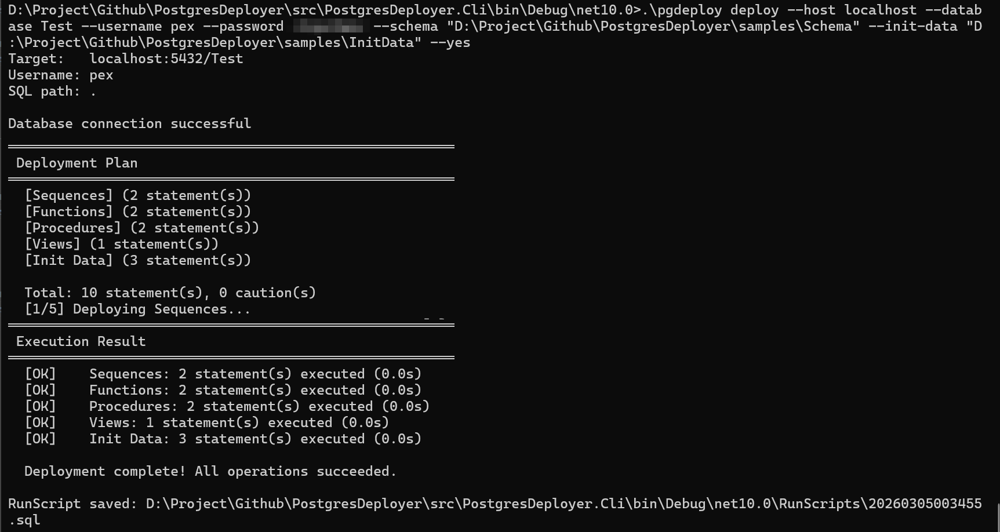
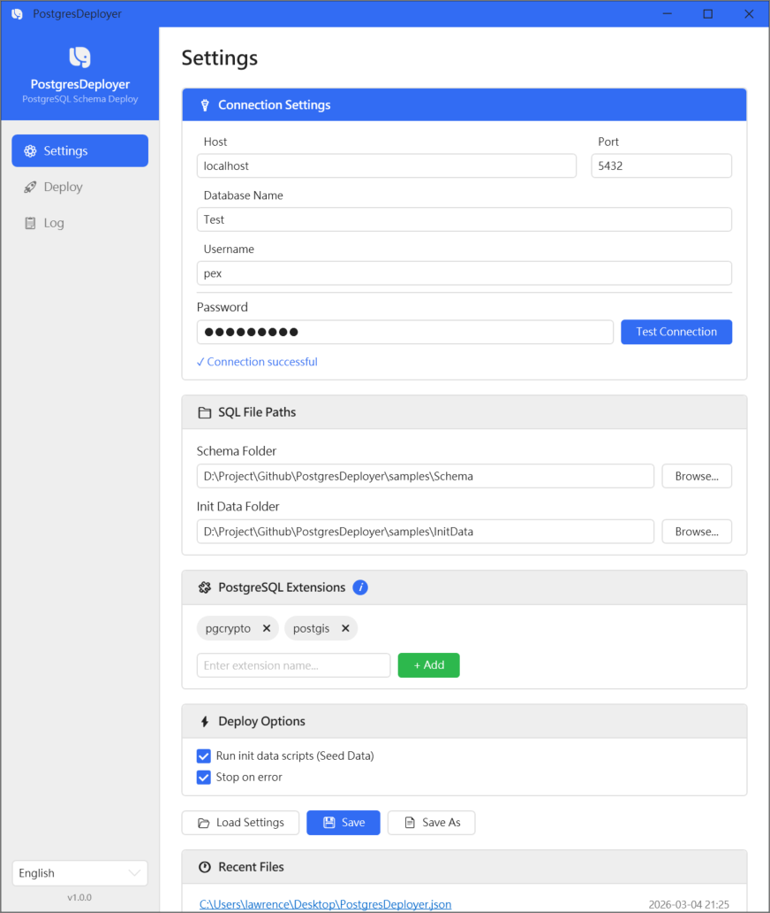
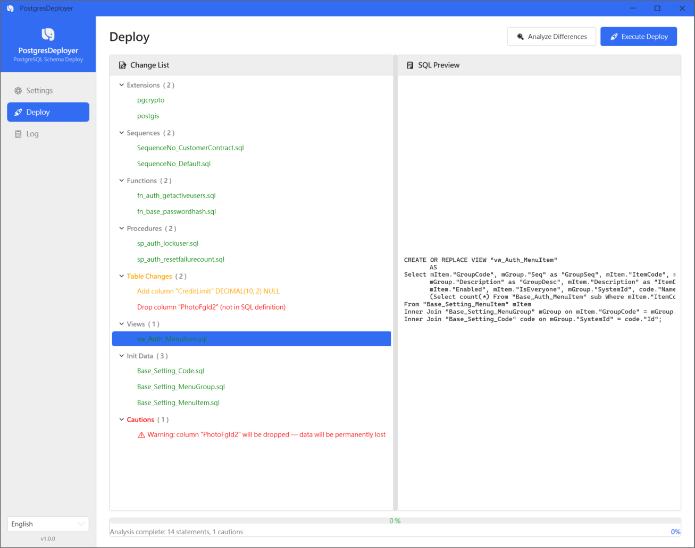
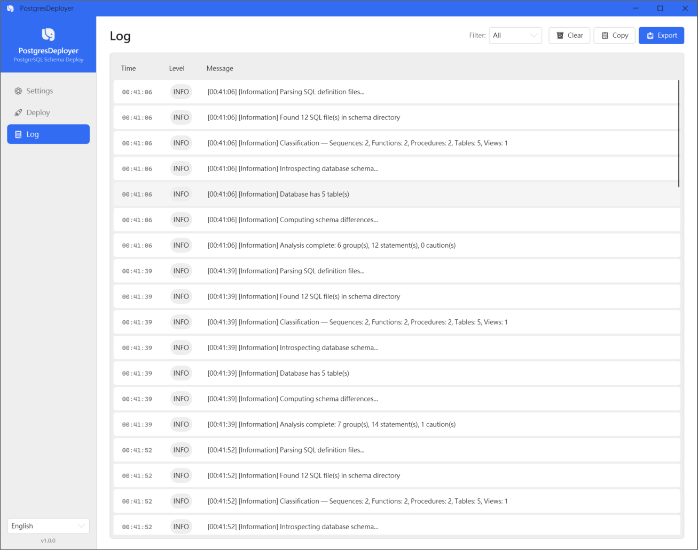

[English](README.md) | [繁體中文](README.zh-TW.md)

# PostgresDeployer


通用 PostgreSQL Schema 部署工具 — 將資料庫結構定義在 SQL 檔案中，每次部署時自動偵測差異並套用變更。

靈感來自 MSSQL SSDT/DACPAC，專為 PostgreSQL 打造。

## 目錄

- [為什麼需要 PostgresDeployer？](#為什麼需要-postgresdeployer)
- [功能特色](#功能特色)
- [功能展示](#功能展示)
- [快速開始](#快速開始)
- [快速體驗：範例專案](#快速體驗範例專案)
- [CLI 使用說明](#cli-使用說明)
- [WPF 桌面應用程式](#wpf-桌面應用程式)
- [支援的 Schema 變更類型](#支援的-schema-變更類型)
- [開發者文件](#開發者文件)
- [授權](#授權)

## 為什麼需要 PostgresDeployer？

Visual Studio 的 **SQL Server Database Projects** 提供了極佳的資料庫 Schema 管理體驗 — 每個資料庫物件都是獨立的檔案，透過 Git 追蹤變更，部署時自動計算差異。然而這套機制只能用於 **Microsoft SQL Server**，無法支援 PostgreSQL。

**Flyway**、**Liquibase** 等遷移式工具雖然支援 PostgreSQL 且廣為使用，但採用了截然不同的方式：每次變更都是一個版本化的遷移腳本，一張資料表的當前定義可能散落在數十甚至數百個腳本中。

PostgresDeployer 採用**期望狀態（Desired State）**方式：

- **單一事實：** 每張資料表只有一個 `.sql` 檔案，永遠反映**完整、最新的結構**。
- **清晰歷程：** 該檔案的 Git 歷史紀錄即是資料表的完整演變歷程，打開就能看懂全貌。
- **自動比對：** 無需手寫升級腳本，工具會比對你的 **期望 Schema** 與 **實際資料庫 Schema**，自動產生必要的增量變更（Diff）。
- **冪等性（Idempotent）：** 多次執行產生相同結果，大幅降低人為介入成本。

## 功能特色

- 自動偵測 Schema 差異（資料表、欄位、型別、Nullable、預設值、索引、主鍵）
- 基於 Transaction 的安全部署，失敗時自動 Rollback
- Dry-run 模式，可預覽變更而不實際執行
- 高風險操作的 Caution 警告機制
- 支援 MERGE 陳述式的種子資料（Seed Data）
- PostgreSQL Extension 管理（例如 `pgcrypto`）
- CLI 工具，適用於腳本化與 CI/CD 部署
- WPF 桌面應用程式，適用於互動式操作
- 執行時語系切換（English / 繁體中文）

## 功能展示

### CLI 應用程式



### WPF 應用程式

#### 設定


#### 部署


#### 日誌


## 快速開始

### 前置需求

- .NET 10.0 Runtime
- PostgreSQL 16+

### 下載

從 [Releases](https://github.com/lawrence8358/PostgresDeployer/releases) 頁面下載最新版本：

- `cli-win-x64.zip` — CLI（命令列工具）
- `wpf-win-x64.zip` — WPF 桌面應用程式

## 快速體驗：範例專案

[`samples/`](samples/) 目錄包含一套完整的範例資料庫 Schema，可直接部署：

```
samples/
├── Schema/
│   ├── Tables/       # 資料表定義（含 UUID PK、IDENTITY 欄位、複合主鍵範例）
│   ├── Views/        # View 定義（複雜的 JOIN 查詢）
│   ├── Functions/    # Function 定義（密碼雜湊、使用者查詢）
│   ├── Procedures/   # Stored Procedure（鎖定使用者、重設失敗計數）
│   └── Sequences/    # Sequence 定義
└── InitData/         # 種子資料（參考資料的 MERGE 陳述式）
```

部署範例 Schema：

```bash
# 1. 為範例資料庫產生設定檔
pgdeploy init --output samples/PostgresDeployer.json

# 2. 編輯 samples/PostgresDeployer.json 中的連線資訊

# 3. 執行部署
pgdeploy deploy --config samples/PostgresDeployer.json
```

## CLI 使用說明

### 常用指令

```bash
# 產生設定檔範本
pgdeploy init

# 測試資料庫連線
pgdeploy test-connection --config PostgresDeployer.json

# 預覽 Schema 差異（不套用任何變更）
pgdeploy diff --config PostgresDeployer.json

# 部署 Schema 變更（會詢問確認）
pgdeploy deploy --config PostgresDeployer.json

# Dry run — 預覽變更而不實際執行
pgdeploy deploy --config PostgresDeployer.json --dry-run
```

### 進階範例

```bash
# 跳過確認提示直接部署
pgdeploy deploy --config PostgresDeployer.json --yes

# 只部署資料表（跳過 View 與種子資料）
pgdeploy deploy --config PostgresDeployer.json --only tables

# 將部署日誌寫入檔案
pgdeploy deploy --config PostgresDeployer.json --log-file deploy.log
```

### 指令參考

| 指令 | 說明 |
|------|------|
| `deploy` | 偵測 Schema 差異並套用變更 |
| `diff` | 分析差異並輸出報告（不套用變更） |
| `test-connection` | 測試資料庫連線 |
| `init` | 產生設定檔範本 |

**公用選項**
所有指令均支援直接傳入連線參數（優先於設定檔）：

| 選項 | 縮寫 | 說明 |
|------|------|------|
| `--config` | `-c` | JSON 設定檔路徑 |
| `--host` | `-H` | PostgreSQL 主機位址 |
| `--port` | `-P` | PostgreSQL 連接埠 |
| `--database` | `-d` | 資料庫名稱 |
| `--username` | `-u` | 使用者名稱 |
| `--password` | `-p` | 密碼 |

**`deploy` 專用選項**

| 選項 | 說明 |
|------|------|
| `--dry-run` | 僅預覽變更，不實際執行 |
| `--yes` | 跳過確認提示 |
| `--only` | 只部署 `tables`、`views`、`seeds` 或 `all`（預設：`all`）|
| `--log-file` | 將部署日誌寫入指定檔案 |
| `--stop-on-error` | 任一群組執行失敗時停止部署（預設：true）|
| `--base-path` | SQL 檔案根目錄 |
| `--schema` | Schema DDL 子目錄（包含 Tables/、Views/、Functions/ 等） |
| `--init-data` | 種子資料子目錄 |
| `--extensions` | 要確保安裝的 PostgreSQL Extension（逗號分隔）|

**部署紀錄（RunScript）**
每次執行部署完成後，PostgresDeployer 會自動將本次實際執行的 SQL 語句，依執行順序合併輸出至執行程式目錄下的 `RunScripts/` 資料夾：

```
RunScripts/
└── 20260304152233.sql
```

此紀錄包含所有變更與種子資料，方便事後追蹤、審查或供其他平台使用。

**`diff` 專用選項**

| 選項 | 說明 |
|------|------|
| `--output` / `-o` | 將差異報告輸出至檔案 |

### 設定檔格式

使用 `pgdeploy init` 產生設定檔後，依環境修改資訊：

```json
{
  "connection": {
    "host": "localhost",
    "port": 5432,
    "database": "MyDatabase",
    "username": "postgres",
    "password": ""
  },
  "paths": {
    "basePath": ".",
    "schema": "Schema",
    "initData": "InitData"
  },
  "extensions": ["pgcrypto"],
  "options": {
    "executeSeedData": true,
    "stopOnError": true
  }
}
```

**參數優先順序**：CLI 參數 > 設定檔 > 預設值

### CI/CD 自動化部署

在自動化流程中，將資料庫密碼存放在提交至版本庫的設定檔裡會有資安風險。建議設定檔只保留非敏感設定，連線憑證在執行時由平台 Secret 機制注入。

**GitHub Actions 範例：**

```yaml
- name: Deploy database schema
  run: |
    pgdeploy deploy \
      --config PostgresDeployer.json \
      --host ${{ secrets.DB_HOST }} \
      --database ${{ secrets.DB_NAME }} \
      --username ${{ secrets.DB_USER }} \
      --password ${{ secrets.DB_PASSWORD }} \
      --yes
```

**GitLab CI / 一般 Shell 腳本範例：**

```bash
pgdeploy deploy \
  --config PostgresDeployer.json \
  --host "$DB_HOST" \
  --database "$DB_NAME" \
  --username "$DB_USER" \
  --password "$DB_PASSWORD" \
  --yes
```

**完全無 config 檔的範例**（所有設定透過 CLI 參數傳入）：

```bash
pgdeploy deploy \
  --host "$DB_HOST" \
  --port 5432 \
  --database "$DB_NAME" \
  --username "$DB_USER" \
  --password "$DB_PASSWORD" \
  --base-path ./Schema \
  --schema Schema \
  --init-data InitData \
  --extensions "pgcrypto" \
  --stop-on-error \
  --yes
```

> **提示**：`--yes` 可跳過互動式確認提示，在 CI 非互動環境中為必要選項。

## WPF 桌面應用程式

WPF 應用程式提供互動式的 Schema 部署與管理介面，與指令列享有完全相同的功能核心：

1. **設定** — 載入或建立設定檔、視覺化編輯連線與路徑、進行快速連線測試
2. **部署** — 分析 Schema 差異、以明確的警告與顏色標示檢視變更清單，最後一鍵執行
3. **日誌** — 顯示包含詳細流程與警示的即時部署日誌

可從左邊欄位設定鈕在執行時切換語系（English / 繁體中文）。所有編輯後的設定也可以存成 json 設定檔供日後或 CI/CD 使用。

## 支援的 Schema 變更類型

所有變更皆會自動偵測，並依正確順序套用：

| 符號 | 變更類型 | 說明 |
|------|---------|------|
| `[+TABLE]` | 建立資料表 | SQL 定義檔中有，但 DB 中不存在的資料表 |
| `[+COL]` | 新增欄位 | 資料表中新增的欄位 |
| `[~TYPE]` | 變更欄位型別 | 欄位資料型別已改變 |
| `[~NULL]` | 變更 Nullable | NULL / NOT NULL 條件約束改變 |
| `[~DFLT]` | 變更預設值 | DEFAULT 值改變或移除 |
| `[+IDX]` | 建立索引 | 新增的索引 |
| `[~IDX]` | 重建索引 | 索引定義改變（先 DROP 再 CREATE）|
| `[-IDX]` | 刪除索引 | 定義中已移除的索引 |
| `[-COL]` | 刪除欄位 | 定義中已移除的欄位 |
| `[~PK]` | 重建主鍵 | 主鍵定義已改變 |

> **Caution 操作** — 可能造成資料遺失的變更（刪除欄位、主鍵變更、型別縮減、在無預設值的情況下加入 NOT NULL）會以 `[!]` 警告標示，需明確確認後才會套用。

## 開發者文件

請參閱 [docs/](docs/) 目錄中的開發者指引。

## 授權

MIT
